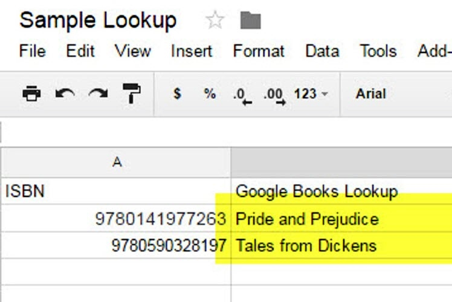
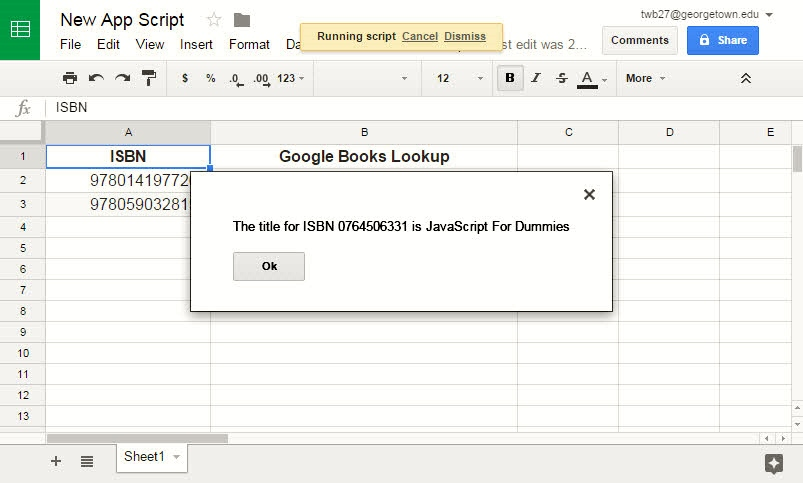
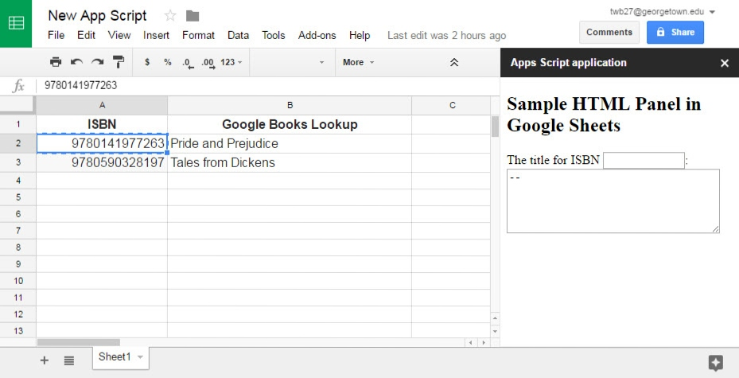

#HSLIDE
### Building Library Applications with Google Apps Script

- <a target="_blank" href="https://github.com/terrywbrady/info">Terry Brady</a>, Georgetown University Library
- <a target="_blank" href="https://craigboman.github.io">Craig Boman</a>, University of Dayton Library

#HSLIDE
### Training Overview
- What is Google Apps Script <!-- .element: class="fragment" -->
 - Running Sample Apps Script Examples <!-- .element: class="fragment" -->
- Coding Google Apps Script <!-- .element: class="fragment" -->
 - JavaScript Primer<!-- .element: class="fragment" -->
 - Building a Sample Application<!-- .element: class="fragment" -->
- Using Google Apps Script in the Library<!-- .element: class="fragment" -->
 - Brainstorming possible uses  <!-- .element: class="fragment" -->

#HSLIDE
### What is Google Apps Script?

Google Apps Script is a server-side implementation of JavaScript with access to several Google API's.

<a target="_blank" href="https://developers.google.com/apps-script/">Google Apps Script Documentation</a>

#HSLIDE

### How can Google Apps Script be Accessed?
- Google Script Project on Google Drive <!-- .element: class="fragment" -->
- Embedded in a Google Product <!-- .element: class="fragment" -->
  - Document
  - Sheet
  - Google Form
  - Google Site
- Packaged for the Chrome Store as an Add-On <!-- .element: class="fragment" -->
  
#VSLIDE
#### Standalone Google Script Project
- Runnable on demand from the script editor
- Deploy-able as a web service
- Schedule-able as a trigger (time-driven)

#VSLIDE
#### When embedded in a Google Document... 
- Runnable from a custom menu item 
- Invoke-able as a spreadsheet formula 
- Triggered by a user event 
 - onOpen()
 - onEdit()

#VSLIDE
#### Packaged for the Chrome Store as an Add-On
- Offered to the Public
  - For Sale or For Free 
- Offered to your Google Apps Domain 
- Offered Privately by URL
  
#HSLIDE
### Why Use Google Apps Script?
- It is available where your users already are <!-- .element: class="fragment" -->
  - No need to introduce another login 
- Sometimes a Document or a Spreadsheet provides the correct level of complexity to solve a problem  <!-- .element: class="fragment" -->
- Can be authorized to access personal Google Services (Mail, Calendar, Drive) <!-- .element: class="fragment" -->

#VSLIDE
### Sharing Google Apps Script?
- Sharable using existing Google Drive sharing options 
- User must authorize the specific functions that will be performed by the script 
- Configurable Authorization 
  - Run as the user running the script 
  - Run as the author of the script 

#HSLIDE
### App Examples
- App Example 1: Building a Web Service <!-- .element: class="fragment" -->
 - Saves Results to Google Drive
- App Example 2: Extending Google Sheets <!-- .element: class="fragment" -->
 - Publish from Sheets to Google Sites and Gmail
- Code Example 3: Embed Interactive HTML App <!-- .element: class="fragment" -->
 - Add an HTML Panel to Google Sheets
 - Add client-side JavaScript
 - Perform ISBN Lookup

#HSLIDE
##### Example 1: Web Service to Facilitate Metadata Collaboration
- Librarians often work with text strings that look like numbers or dates
 - Call numbers, Accession Numbers
- What would happen to this data (by default) in Excel or Google Sheets?
```
Col A, Col B, Col C
One,Preserve date as MM/DD/YYYY,01/01/2017
Two,Preserve date as YYYY-MM-DD,2017-01-01
Three,Preserve Number with leading zeros,00002222
```
- What happens when the data is shared?

#VSLIDE
##### Example 1: A Web Service to Upload a CSV to Google Sheets
- Load data to CSV
- Disable auto-correct in all cells

#VSLIDE
##### Example 1: Clone Project for Yourself
- <a target="_blank" href="https://script.google.com/d/13HcFhMle_oIBTfhuZEya_zQHAokJjgZEdqTEoOTeEfrpx5UpTmNUh_pB/edit?usp=sharing">Sample Script Project</a>
- Select "Make a Copy" to save an editable copy
- Click "Deploy as Webapp", set the run as parameters as appropriate to you
- Copy the current web app URL

#VSLIDE
##### Example 1: Project Components
- **Code.gs**
 - **doGet()** Display upload page (Index.html)
 - **doPost()** 
   - Process CSV Upload, create Google Sheet
   - Display a link to the generated Sheet (Response.html)
- **Index.html**: CSV Upload Page
- **Response.html**: HTML Fragment to display link to uploaded Sheets

#VSLIDE
##### Example 1: Run it Yourself
- Open the URL you saved - calls doGet()
- Supply a CSV as a file or in the text box provided
- Upload CSV data
```
Col A, Col B, Col C
One,Preserve date as MM/DD/YYYY,01/01/2017
Two,Preserve date as YYYY-MM-DD,2017-01-01
Three,Preserve Number with leading zeros,00002222
```
- Click the link to the generated spreadsheet

#VSLIDE
##### Example 1: References
- <a target="_blank" href="https://script.google.com/d/13HcFhMle_oIBTfhuZEya_zQHAokJjgZEdqTEoOTeEfrpx5UpTmNUh_pB/edit?usp=sharing">Sample Script Project</a>
- <a target="_blank" href="https://github.com/terrywbrady/PlainTextCSV_GoogleAppsScript">Code on Github</a>
- <a target="_blank" href="https://github.com/Georgetown-University-Libraries/PlainTextCSV_GoogleAppsScript/blob/master/README.md">Sample Screen Shots</a>

#VSLIDE
##### Example 1: Demo


#HSLIDE
### Example 2: Sample Application Integrated with Google Services
- Illustrates what an application can do with Google Services
- User edits a spreadsheet
 - Spreadsheet content is published by Gmail
 - Spreadsheet content is published to Google Sites

#VSLIDE
### Example 2: Publish Weekly Volunteer Assignments from Google Sheets
- Developed for an org in which several folks had limited computer literacy
 - Publish assignment updates to Google Sites daily
 - Email upcoming assignments once a week (with a link to Google Sites)

#VSLIDE
## Example 2: Sample Spreadsheet
- Dates in column headers (Row 1)
 - Code detects the next date to publish
- Times (on a specific day) are defined in Row 2
- Roles (to be assigned) are defined in column A

#VSLIDE?image=https://github.com/terrywbrady/OnlineRota_GoogleAppsScript/raw/master/screenshots/sheet1.jpg

#VSLIDE
## Example 2: Edit an assignment

#VSLIDE?image=https://github.com/terrywbrady/OnlineRota_GoogleAppsScript/raw/master/screenshots/sheet2.jpg

#VSLIDE
## Example 2: E-mail Future Assignments 
A date trigger is also set up to send e-mail weekly

#VSLIDE?image=https://github.com/terrywbrady/OnlineRota_GoogleAppsScript/raw/master/screenshots/sheet3.jpg

#VSLIDE
## Example 2: Sample e-mail containing the changes
Note that the sample e-mail was sent in Nov 2016

#VSLIDE


#VSLIDE
## Example 2: Publish Changes to Google Sites 
A date trigger is also set up to update Google Sites Daily

#VSLIDE?image=https://github.com/terrywbrady/OnlineRota_GoogleAppsScript/raw/master/screenshots/sheet4.jpg

#VSLIDE
## Example 2: Sample Google Site Page containing the changes
Note that the sample page was updated in Nov 2016

#VSLIDE


#VSLIDE
#####  Example 2: Clone/Configure for Yourself
- <a target="_blank" href="https://docs.google.com/spreadsheets/d/1T_AnSoz893QY1IL9uH9L8mH220Wp6WE_Weaq3VkxOX4/edit#gid=0">Sample Spreadsheet</a>
- Select "Make a Copy" to save an editable copy
- Create a personal Google Site
  - Create a page within the site named "rotasearch"
  - Set a script property named "siteid" with a URL to your new site 

#VSLIDE
#####  Example 2: Run it for yourself
- Make an edit
- Send email
- Publish to Google Sites.  See the following <a target="_blank" href="https://sites.google.com/a/georgetown.edu/examples/rotasearch">Google Sites example</a>
- Create a trigger to call "sendRota" on a daily basis
  
#VSLIDE
##### Example 2: Sceenshot of Trigger Menu


#VSLIDE
##### Example 2: Screenshot of Create Trigger


#VSLIDE
##### Example 2: Create Trigger


#VSLIDE
### Example 2: References
- <a target="_blank" href="https://docs.google.com/spreadsheets/d/1T_AnSoz893QY1IL9uH9L8mH220Wp6WE_Weaq3VkxOX4/edit#gid=0">Sample Spreadsheet</a>
- <a target="_blank" href="https://github.com/terrywbrady/OnlineRota_GoogleAppsScript">Code on GitHub</a>
- <a target="_blank" href="https://github.com/terrywbrady/OnlineRota_GoogleAppsScript/blob/master/README.md">Sample Screen Shots</a>

#VSLIDE
##### Example 2: Create a Google Site


#VSLIDE
##### Example 2: Publish from the Rota Spreadsheet


#HSLIDE
### Coding Google Apps Script
Before coding Google Apps Script, we will review JavaScript coding
- Online JavaScript Resources
- Offline JavaScript Tutorial 

#VSLIDE
### JavaScript Primer

Online Resources
* <a target="_blank" href="http://www.w3schools.com/js/default.asp">W3Schools Tutorial</a>
* <a target="_blank" href="https://jsfiddle.net/">JSFiddle - Test Your JavaScript</a>

#VSLIDE
### Offline Testing
The following JavaScript tutorial is here in case we have limited internet access

#VSLIDE
### Offline Testing
Save the following to your desktop as test.html.
```
<html>
  <head>
    <script type="text/javascript" src="test.js"></script>
  </head>
  <body>
    <h1>JS Testing</h1>
    <button onclick="hello()">Say Hello</button>
  </body>
</html>
```

#VSLIDE
### Create a JavaScript Function
Save the following to your desktop as test.js.
```
function hello(){
  alert("hello from alert");
}
```

#VSLIDE
### Set a variable (Number)
Numbers can be assigned to a variable or computed by function.
```
var count = 0;

function hello(){
  count = count + 1;
  alert("hello from alert :" + count);
}
```

#VSLIDE
### Set a variable (String)
Strings are assigned by enclosing them with quotes.
```
function hello(){
  var name = "my friend";
  alert("hello from alert :" + name);
}
```

#VSLIDE
### Set a variable (Array)
```
function hello(){
  //assign multiple values in brackets
  var arr = ["cat", "dog", "bird"];
  //reference values by position in brackets, starting with zero
  alert("First item: " + arr[0] + ".  All items: " + arr.join(","));
}
```

#VSLIDE
### Set a variable (Object with simple property name)
```
function hello(){
  //assign properties within curly braces
  var president = {first: "George", last: "Washington"};
  //reference simple properties with a period
  alert("Hello President " + president.last);
}
```

#VSLIDE
### Set a variable (Object with complex property name)
```
function hello(){
  //complex property names must be quoted
  var president = {"first-name": "George", "last-name": "Washington"};
  //complex property names are referenced within brackets
  alert("Hello President " + president["last-name"]);
}
```

#VSLIDE
### Return a value from a function
```
//declare a function
function greeting(){
  return "Greetings";
}

function hello(){
  //call a function by adding parentheses
  alert(greeting());
}
```

#VSLIDE
### Call a function with a parameter
```
//function parameters are declared inside parentheses
function greeting(name){
  return "Greetings, " + name;
}

function hello(){
  //function parameters are passed inside parentheses
  alert(greeting("Friend"));
}
```

#VSLIDE
### Calling a function on an object
```
function hello(){
  var president = {
    first: "George", 
    last: "Washington",
    //object can contain functions
    respond: function() {return "Call me " + this.first;} 
  };
  //functions within an object can be called
  alert(president.respond());
}
```

#VSLIDE
### Using JQuery (if we have internet)

Add the following to your html header
```
<script src="https://ajax.googleapis.com/ajax/libs/jquery/3.1.1/jquery.min.js"></script>
```
Add the following to your html body
```
<input id="myname" type="text"/>
```

#VSLIDE
### Use JQuery to get user input from web page
JQuery makes it easy to refernce input fields on a page regardless of your browser.  
```
function greeting(name){
  return "Greetings, " + name;
}

function hello(){
  //$ is used to call a JQuery function
  //"#myname" looks for a field with id="myname"
  //.val() returns the value supplied by the user
  var name=$("#myname").val();
  alert(greeting(name));
}
```

#HSLIDE
##### Code Example 3: Add Interactive HTML App to Google Sheets

- Create an application in Google Sheets that looks up ISBN numbers and returns book titles


#VSLIDE
##### Code Example 3: Add Interactive HTML App to Google Sheets
We will build the sample ISBN lookup app in 6 parts
 - 3A: Simulated ISBN Lookup <!-- .element: class="fragment" -->
 - 3B: Lookup ISBN with Google Books API <!-- .element: class="fragment" -->
 - 3C: Display Lookup Results with Google Sheets UI <!-- .element: class="fragment" -->
 - 3D: Display a static HTML panel <!-- .element: class="fragment" -->
 - 3E: Display a Templated HTML panel (with lookup results) <!-- .element: class="fragment" -->
 - 3F: Display an Interactive HTML panel (to lookup results) <!-- .element: class="fragment" -->

#HSLIDE
##### Example 3A: Creating a Test Google Sheet With Fake ISBN Lookup

Create a Google Sheet with the following data

|ISBN|Google Books Lookup|
|---|---|
|9780141977263||
|9780590328197||

#VSLIDE
##### Example 3A: Create a Script within the Sheet
- Tools -> Script Editor
- This will open up the Apps Script Cloud IDE

#VSLIDE
##### Example 3A: Add the following script code
```
function isbnLookup(id) {
    return "Sample ISBN Lookup " + id;
}

function test() {
  var isbn = "9780141977263";
  var title = isbnLookup(isbn)
  var msg = "The title for ISBN " + isbn + " is " + title;
  Logger.log(msg);
}
```
#VSLIDE
##### Example 3A: Save the Script Project

Name the project something like "Test Project"

#VSLIDE
##### Example 3A: Test the script

From the "Select function" drop down, select "test" and click the "Run" or "Debug" button 


#VSLIDE
##### Example 3A: View Log Output

Click "View Logs" to confirm that the function ran.


#VSLIDE
##### Example 3A: View Log Output


#VSLIDE
##### Example 3A: Use the script as a Spreadsheet formula

Modify cell B2 to contain the following formula 
```
=isbnLookup(A2)
```
Copy cell B2 into cell B3 to create the following formula 
```
=isbnLookup(A3)
```

#VSLIDE
##### Example 3A: View Formula Output


#VSLIDE
##### Example 3a: Simulate an ISBN Lookup in Google Sheets


#HSLIDE
##### Example 3B: Enhance the script with an external service call
- <a target="_blank" href="https://developers.google.com/apps-script/reference/url-fetch/url-fetch-app">Google Apps Script API Reference for UrlFetchApp</a>
- Update the isbnLookup function to use the <a target="_blank" href="https://developers.google.com/books/docs/v1/using#web-applications">Google Books API</a> to lookup the isbn

#VSLIDE
##### Example 3B: Call Google Books Service 
```
function isbnLookup(id) {
  var url = "https://www.googleapis.com/books/v1/volumes?country=US&q=isbn:"+id+getApiKey();
  var options = {contentType : "application/json"};

  var resp = UrlFetchApp.fetch(url, options);
  if (resp == null || resp == "") return "N/A";

  var respdata = JSON.parse(resp.getContentText());
  if (respdata["items"] == undefined) return "Not found";
  if (respdata["items"].length == 0) return "Not found";

  var data = respdata["items"][0]["volumeInfo"];
  return (data["subtitle"] == undefined) ? 
    data["title"] : data["title"] + ": " + data["subtitle"];
}
```
#VSLIDE
##### Example 3B: API Key for Google Books 
Without an API key, Google may throttle your requests
```
function getApiKey() {
  //Request a booksapi key from Google
  //Set a script property using File->Project Properties->Script Properties
  var key = PropertiesService.getScriptProperties().getProperty("booksapi");
  //Logger.log(key);
  return key == undefined ? "" : "&key="+key;
}
```

#VSLIDE
##### Example 3B: Run the "test()" function again
- The first time you run this, you will need to authorize Google Apps to send data to an external URL


#VSLIDE
##### Example 3B: Reload the Spreadsheet 


#VSLIDE
##### Example 3b: ISBN Lookup with Google Books Api


#HSLIDE
##### Example 3C: Call Your Function from the Sheets UI
- Add Menu to Google Sheets
```
function onOpen(e) {
  SpreadsheetApp.getUi()
    .createAddonMenu()
    .addItem("Test Function", "test")
    .addToUi();
}
```

#VSLIDE
##### Example 3C: Reload to See the New Menu


#VSLIDE
##### Example 3C: Add UI Confirmation to the test() function

Modify the test() function to access the <a target="_blank" href="https://developers.google.com/apps-script/reference/spreadsheet/spreadsheet-app#getUi()">Spreadsheet UI</a>

```
function test() {
  var isbn = "0764506331";
  var title = isbnLookup(isbn)
  var msg = "The title for ISBN " + isbn + " is " + title;
  Logger.log(msg);
  SpreadsheetApp.getUi().alert(msg);
}
```

#VSLIDE
##### Example 3C: Call the test function from the new menu


#VSLIDE
##### Example 3c: Display User Feedback with the Google Sheets UI


#HSLIDE
##### Example 3D: Adding Custom HTML to Your Script

In the script IDE, create "Sidebar.html"

```
<!DOCTYPE html>
<html>
  <head>
    <base target="_top">
  </head>
  <body>
    <h2>Sample HTML Panel in Google Sheets</h2>
    <div>We will use this panel to add additional features to the Spreadsheet</div>
  </body>
</html>
```

#VSLIDE
##### Example 3D: Create HTML


#VSLIDE
##### Example 3D: Add a menu option to load the sidebar

Create a function showSidebar()

```
function showSidebar() {
  var html = HtmlService.createHtmlOutputFromFile("Sidebar.html");
  SpreadsheetApp.getUi().showSidebar(html);
}
```

#VSLIDE
##### Example 3D: Add Menu Option

Add showSidebar() to the Add On Menu

```
function onOpen(e) {
  SpreadsheetApp.getUi()
    .createAddonMenu()
    .addItem("Test Function", "test")
    .addItem("Show Sidebar", "showSidebar")
    .addToUi();
}
```

#VSLIDE
##### Example 3D: Screenshot of Menu Option


#VSLIDE
##### Example 3D: Display Sidebar Output


#VSLIDE
##### Example 3d: Display an HTML Panel in Google Sheets


#HSLIDE
##### Example 3E: Create HTML Template

A template can take an interpret values passed to the template.
- In the script IDE, create "Template.html"

```
<!DOCTYPE html>
<html>
  <head>
    <base target="_top">
  </head>
  <body>
    <h2>Sample HTML Panel in Google Sheets</h2>
    <div>The title for ISBN <?=isbn?>: <?=title?></div>
  </body>
</html>
```

#VSLIDE
##### Example 3E: Display Template Function

Create a function showSidebarTemplate() which passes data to a template

```
function showSidebarTemplate() {
  var t = HtmlService.createTemplateFromFile("Template.html");
  t.isbn = "0596517742";
  t.title = isbnLookup(t.isbn);
  var html = t.evaluate();
  SpreadsheetApp.getUi().showSidebar(html);
}
```

#VSLIDE
##### Example 3E: Add Menu Option

Add a call to showSidebarTemplate() to the Add On Menu

```
function onOpen(e) {
  SpreadsheetApp.getUi()
    .createAddonMenu()
    .addItem("Test Function", "test")
    .addItem("Show Sidebar", "showSidebar")
    .addItem("Show Template", "showSidebarTemplate")
    .addToUi();
}

```

#VSLIDE
##### Example 3E: Screenshot of Menu Option


#VSLIDE
##### Example 3E: Screenshot of Template Output


#VSLIDE
##### Example 3e: Create an HTML Panel from a Template


#HSLIDE
#####  Example 3F: HTML Template with Client JavaScript
Your client JavaScript can invoke server-side methods using *google.script.run*

- In the script IDE, create a new html file named "SidebarWithClientJS.html"

#VSLIDE
HTML File With Client JS: **SidebarWithClientJS.html**
```
<!DOCTYPE html>
<html>
  <head>
    <base target="_top">
    <script src="//ajax.googleapis.com/ajax/libs/jquery/1.9.1/jquery.min.js"></script>
    <!-- Client JavaScript Goes Here (See Next Slide) -->
  </head>
  <body>
    <!-- HTML Body Goes Here (See 2 slides ahead) -->
  </body>
</html>
```

#VSLIDE
HTML Body (Will be Modified by JS)
```
    <h2>Sample HTML Panel in Google Sheets</h2>
    <div>
      The title for ISBN 
      <input id="isbn" type="text" size="14"/>: 
      <textarea id="booktitle" rows="5" cols="35">--</textarea>
    </div>
```

#VSLIDE
Client JavaScript Overview
- Ready function $(function()) is called on page load <!-- .element: class="fragment" --> 
- onBlur() event added to ISBN <!-- .element: class="fragment" -->
- User enters a value into ISBN <!-- .element: class="fragment" -->
- onBlur() is called <!-- .element: class="fragment" -->
  - BOOKTITLE is cleared <!-- .element: class="fragment" -->
  - The value entered into ISBN is passed to the server-side function isbnLookup() <!-- .element: class="fragment" -->
    - If successful, showValue() will be invoked <!-- .element: class="fragment" -->
      - BOOKTITLE is updated with the title <!-- .element: class="fragment" -->

#VSLIDE
Client JavaScript
```
<script>
function showValue(data) {
  $("#booktitle").val(data);
}
$(function(){
  $("#isbn").on("blur", function(){
    $("#booktitle").val("");
    google.script.run.withSuccessHandler(showValue)
      .isbnLookup($("#isbn").val());
  });
});
</script>
```

#VSLIDE
Complete File (For Copy/Paste)
```
<!DOCTYPE html>
<html>
  <head>
    <base target="_top">
    <script src="//ajax.googleapis.com/ajax/libs/jquery/1.9.1/jquery.min.js"></script>
    <script>
    function showValue(data) {
      $("#booktitle").val(data);
    }
    $(function(){
      $("#isbn").on("blur", function(){
        $("#booktitle").val("");
        google.script.run.withSuccessHandler(showValue)
          .isbnLookup($("#isbn").val());
      });
    });
  </script>
  </head>
  <body>
    <h2>Sample HTML Panel in Google Sheets</h2>
    <div>
      The title for ISBN 
      <input id="isbn" type="text" size="14"/>: 
      <textarea id="booktitle" rows="5" cols="35">--</textarea>
    </div>
  </body>
</html>
```

#VSLIDE
##### Example 3F: Method to Display Template
Create a function showSidebarWithClientJS()
```
function showSidebarWithClientJS() {
  var html = HtmlService.createHtmlOutputFromFile("SidebarWithClientJS.html");
  SpreadsheetApp.getUi().showSidebar(html);
}
```

#VSLIDE
##### Example 3F: Add Menu Item
Add a call to showSidebarWithClientJS() to the Add On Menu
```
function onOpen(e) {
  SpreadsheetApp.getUi()
    .createAddonMenu()
    .addItem("Test Function", "test")
    .addItem("Show Sidebar", "showSidebar")
    .addItem("Show Template", "showSidebarTemplate")
    .addItem("Show Sidebar With Client JS", "showSidebarWithClientJS")
    .addToUi();
}
```

#VSLIDE
##### Example 3F: Screenshot of Menu Option


#VSLIDE
##### Example 3F: Display HTML Page
An onBlur event is bound to the ISBN field.


#VSLIDE
##### Example 3F: Invoke Server JS from Client JS
The title field is updated after entering an ISBN.


#VSLIDE
##### Example 3f: Add Client Side JavaScript to an HTML Panel


#HSLIDE
##### Note About Trigger Restrictions
- When installing an onOpen() trigger or other special triggers some <a target="_blank" href="https://developers.google.com/apps-script/guides/triggers/">restrictions</a> apply to what your script can do
- You may need to simplify the actions performed with a trigger and defer them to a user-driven action
- If you see unexpected behavior in your scripts, evaluate if one of these restrictions has applied

#HSLIDE
##### Useful Reference
- <a target="_blank" href="https://developers.google.com/apps-script/quickstart/docs">Creating a Google Doc Add-On Example</a>
- <a target="_blank" href="https://developers.google.com/apps-script/guides/html/templates">Templated HTML</a>
- <a target="_blank" href="https://developers.google.com/apps-script/guides/html/reference/run">Calling Server Side Functions from Client JavaScript</a>

#HSLIDE
### Using Google App Script In the Library
- How are Google Apps used in your library?
- Where could Google Apps be useful?
- What Common Extensions would be of use to Code4Lib?
- Would this group like to initiate a project together? 

#HSLIDE
### Thank You!

- <a target="_blank" href="http://www.github.com/terrywbrady/info">Terry Brady</a>, Georgetown University Library
- <a target="_blank" href="https://craigboman.github.io">Craig Boman</a>, University of Dayton Library
