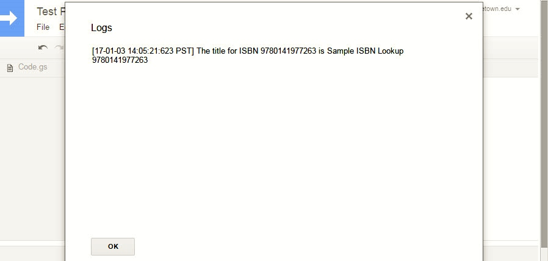
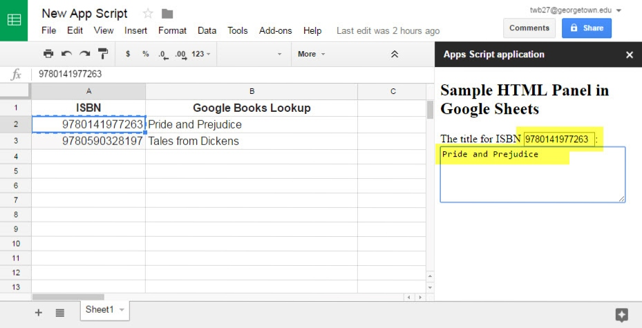

#HSLIDE
### Building Simple Apps with Google App Script

Terry Brady

Georgetown University Library

<a target="_blank" href="https://github.com/terrywbrady/info">https://github.com/terrywbrady/info</a>


#HSLIDE
### What is Google App Script?

Google App Script is a server-side implementation of JavaScript with access to several Google API's.

<a target="_blank" href="https://developers.google.com/apps-script/">Google Apps Script Documentation</a>

#HSLIDE

### How can Google App Script be Used?
- Accessible as a standalone Google Script project on Google Drive
- Embedded in a Google Document, a Google Sheet, a Google Form, or a Google Site
- Packaged for the Chrome Store as an Add-On
  
#VSLIDE
#### Accessible as a standalone Google Script project on Google Drive
- Runnable on demand from the script editor
- Deployable as a web service
- Schedulable as a trigger (time-driven)

#VSLIDE
#### Embedded in a Google Document, a Google Sheet, a Google Form, or a Google Site
- Runnable from a custom menu item
- Triggered by a user event (on Edit/on Open action)
- Available as a spreadsheet formula
- All of the standalone script options are also available for embedded scripts

#VSLIDE
#### Packaged for the Chrome Store as an Add-On
- Offered for Sale to the Public
- Offered for Free to the Public
- Offered for Free to your Apps Domain
- Offered Privately by URL
  
#HSLIDE
### Why Use Google Apps Script?
- It is available where your users already are
  - No need to introduce another login
  - Sharable using existing Google Drive sharing options
  - Configuratable Authorization
  - User must authorize the permissions granted to the script
- Sometimes a Document or a Spreadsheet provides the correct level of complexity to solve a problem

#VSLIDE

Configuratable Authorization Options
- Script can run as the user running the script
- Script can run as the author of the script
- Script can be authorized to access personal Google Services (Mail, Calendar, Drive)


#HSLIDE
### Complete App Examples
- Example 1: Building a Web Service to Save to Google Drive
- Example 2: Extending Google Apps
- Example 3: Google Sheet with ISBN Lookup

#HSLIDE
##### Example 1: A Web Service to Upload a CSV to Google Sheets
- Auto-correct in Excel and Google Sheets is a frequent problem for librarians editing metadata
- CSV files can be corrupted when shared between users
- <a target="_blank" href="https://script.google.com/d/13HcFhMle_oIBTfhuZEya_zQHAokJjgZEdqTEoOTeEfrpx5UpTmNUh_pB/edit?usp=sharing">Sample Script Project</a>
- <a target="_blank" href="https://github.com/terrywbrady/PlainTextCSV_GoogleAppsScript">Code on Github</a>
- <a target="_blank" href="https://github.com/Georgetown-University-Libraries/PlainTextCSV_GoogleAppsScript/blob/master/README.md">Sample Screen Shots</a>

#VSLIDE
##### Example 1: Clone Project for Yourself
- <a target="_blank" href="https://script.google.com/d/13HcFhMle_oIBTfhuZEya_zQHAokJjgZEdqTEoOTeEfrpx5UpTmNUh_pB/edit?usp=sharing">Sample Script Project</a>
- Select "Make a Copy" to save an editable copy
- Click "Deploy as Webapp", set the run as parameters as appropriate to you
- Copy the current web app URL

#VSLIDE
##### Example 1: Run it Yourself
- Open the URL you saved
- Supply a CSV as a file or in the text box provided
- Upload CSV data
```
Col A, Col B, Col C
One,Preserve date as MM/DD/YYYY,01/01/2017
Two,Preserve date as YYYY-MM-DD,2017-01-01
Three,Preserve Number with leading zeros,00002222
```
- Click the link to the generated spreadsheet

#HSLIDE
### Example 2: Weekly Scheduling with Google Sheets
- Volunteer assignment spreadsheet
- Volunteer coordinators had limited computer literacy
- <a target="_blank" href="https://docs.google.com/spreadsheets/d/1T_AnSoz893QY1IL9uH9L8mH220Wp6WE_Weaq3VkxOX4/edit#gid=0">Sample Spreadsheet</a>
- <a target="_blank" href="https://github.com/terrywbrady/OnlineRota_GoogleAppsScript">Code on GitHub</a>
- <a target="_blank" href="https://github.com/terrywbrady/OnlineRota_GoogleAppsScript/blob/master/README.md">Sample Screen Shots</a>

#VSLIDE
#####  Example 2: Clone/Configure for Yourself
- <a target="_blank" href="https://docs.google.com/spreadsheets/d/1T_AnSoz893QY1IL9uH9L8mH220Wp6WE_Weaq3VkxOX4/edit#gid=0">Sample Spreadsheet</a>
- Select "Make a Copy" to save an editable copy
- Create a personal Google Site
  - Create a page within the site named "rotasearch"
  - Set a script property named "siteid" with a URL to your new site 

#VSLIDE
#####  Example 2: Run it for yourself
- Make an edit
- Send email
- Publish to Google Sites.  See the following <a target="_blank" href="https://sites.google.com/a/georgetown.edu/examples/rotasearch">example</a>
- Create a trigger to call "sendRota" on a daily basis
  
#VSLIDE
##### Example 2: Sceenshot of Trigger Menu


#VSLIDE
##### Example 2: Screenshot of Create Trigger


#VSLIDE
##### Example 2: Create Trigger


#HSLIDE
##### Example 3A: Create a Test Google Sheet with ISBN Lookup

We will extend this example to illustrate several featues of Google App Script.

 - 3A: Simulated Lookup
 - 3B: Lookup with Google Books
 - 3C: Add Google Sheet UI
 - 3D: Show HTML
 - 3E: Show Templated HTML
 - 3F: Show HTML with Client JS (Calling Server JS)

#HSLIDE
##### Example 3A: Creating a Test Google Sheet With Fake ISBN Lookup

Create a Google Sheet with the following data

|ISBN|Google Books Lookup|
|---|---|
|9780141977263||
|9780590328197||

#VSLIDE
##### Example 3A: Create a Script within the Sheet
- Tools -> Script Editor
- This will open up the App Script Cloud IDE

#VSLIDE
##### Example 3A: Add the following script code
```
function isbnLookup(id) {
    return "Sample ISBN Lookup " + id;
}

function test() {
  var isbn = "9780141977263";
  var title = isbnLookup(isbn)
  var msg = "The title for ISBN " + isbn + " is " + title;
  Logger.log(msg);
}
```
#VSLIDE
##### Example 3A: Save the Script Project

Name the project something like "Test Project"

#VSLIDE
##### Example 3A: Test the script

From the "Select function" drop down, select "test" and click the "Run" or "Debug" button 


#VSLIDE
##### Example 3A: View Log Output

Click "View Logs" to confirm that the function ran.


#VSLIDE
##### Example 3A: View Log Output



#VSLIDE
##### Example 3A: Use the script as a Spreadsheet formula

Modify cell B2 to contain the following formula 

`=isbnLookup(A2)`

Copy cell B2 into cell B3 to create the following formula 

`=isbnLookup(A3)`

#VSLIDE
##### Example 3A: View Formula Output


#HSLIDE
##### Example 3B: Enhance the script with an external service call
- <a target="_blank" href="https://developers.google.com/apps-script/reference/url-fetch/url-fetch-app">Google Apps Script API Reference for UrlFetchApp</a>
- Update the isbnLookup function to use the <a target="_blank" href="https://developers.google.com/books/docs/v1/using#web-applications">Google Books API</a> to lookup the isbn

#VSLIDE
##### Example 3B: Call Google Books Service 
```
function isbnLookup(id) {
  var url = "https://www.googleapis.com/books/v1/volumes?country=US&q=isbn:"+id;
  var options = {contentType : "application/json"};

  var resp = UrlFetchApp.fetch(url, options);
  if (resp == null || resp == "") return "N/A";

  var respdata = JSON.parse(resp.getContentText());
  if (respdata["items"] == undefined) return "Not found";
  if (respdata["items"].length == 0) return "Not found";

  var data = respdata["items"][0]["volumeInfo"];
  return (data["subtitle"] == undefined) ? data["title"] : data["title"] + ": " + data["subtitle"];
}
```

#VSLIDE
##### Example 3B: Run the "test()" function again
- The first time you run this, you will need to authorize Google Apps to send data to an external URL


#VSLIDE
##### Example 3B: Reload the Spreadsheet 


#HSLIDE
##### Example 3C: Call Your Function from the Sheets UI
- Add the following code to Add Menu to Google Sheets
```
function onOpen(e) {
  SpreadsheetApp.getUi()
    .createAddonMenu()
    .addItem("Test Function", "test")
    .addToUi();
}
```

#VSLIDE
##### Example 3C: Reload to See the New Menu


#VSLIDE
##### Example 3C: Add UI Confirmation to the test() function

Modify the test() function to access the <a target="_blank" href="https://developers.google.com/apps-script/reference/spreadsheet/spreadsheet-app#getUi()">Spreadsheet UI</a>

```
function test() {
  var isbn = "0764506331";
  var title = isbnLookup(isbn)
  var msg = "The title for ISBN " + isbn + " is " + title;
  Logger.log(msg);
  SpreadsheetApp.getUi().alert(msg);
}
```

#VSLIDE
##### Example 3C: Call the test function from the new menu


#HSLIDE
##### Example 3D: Adding Custom HTML to Your Script

In the script IDE, create a new html file named "Sidebar.html"

```
<!DOCTYPE html>
<html>
  <head>
    <base target="_top">
  </head>
  <body>
    <h2>Sample HTML Panel in Google Sheets</h2>
    <div>We will use this panel to add additional features to the Spreadsheet</div>
  </body>
</html>
```

#VSLIDE
##### Example 3D: Create HTML


#VSLIDE
##### Example 3D: Add a menu option to load the sidebar

Create a function showSidebar()

```
function showSidebar() {
  var html = HtmlService.createHtmlOutputFromFile("Sidebar.html");
  SpreadsheetApp.getUi().showSidebar(html);
}
```

#VSLIDE
##### Example 3D: Add Menu Option

Add a call to showSidebar() to the Add On Menu

```
function onOpen(e) {
  SpreadsheetApp.getUi()
    .createAddonMenu()
    .addItem("Test Function", "test")
    .addItem("Show Sidebar", "showSidebar")
    .addToUi();
}
```

#VSLIDE
##### Example 3D: Screenshot of Menu Option


#VSLIDE
##### Example 3D: Display Sidebar Output


#HSLIDE
##### Example 3E: Create HTML Template

A template can take an interpret values passed to the template.
- In the script IDE, create a new html file named "Template.html"

```
<!DOCTYPE html>
<html>
  <head>
    <base target="_top">
  </head>
  <body>
    <h2>Sample HTML Panel in Google Sheets</h2>
    <div>The title for ISBN <?=isbn?>: <?=title?></div>
  </body>
</html>
```

#VSLIDE
##### Example 3E: Display Template Function

Create a function showSidebarTemplate() which passes the output of getMessage() to the template

```
function showSidebarTemplate() {
  var t = HtmlService.createTemplateFromFile("Template.html");
  t.isbn = "0596517742";
  t.title = isbnLookup(t.isbn);
  var html = t.evaluate();
  SpreadsheetApp.getUi().showSidebar(html);
}
```

#VSLIDE
##### Example 3E: Add Menu Option

Add a call to showSidebarTemplate() to the Add On Menu

```
function onOpen(e) {
  SpreadsheetApp.getUi()
    .createAddonMenu()
    .addItem("Test Function", "test")
    .addItem("Show Sidebar", "showSidebar")
    .addItem("Show Template", "showSidebarTemplate")
    .addToUi();
}

```

#VSLIDE
##### Example 3E: Screenshot of Menu Option


#VSLIDE
##### Example 3E: Screenshot of Template Output


#HSLIDE
#####  Example 3F: HTML Template with Client JavaScript
Your client JavaScript can invoke server-side methods using *google.script.run*

- In the script IDE, create a new html file named "SidebarWithClientJS.html"

#VSLIDE
Complete HTML File
```
<!DOCTYPE html>
<html>
  <head>
    <base target="_top">
    <script src="//ajax.googleapis.com/ajax/libs/jquery/1.9.1/jquery.min.js"></script>
    <!-- Client JavaScript Goes Here (See Next Slide) -->
  </head>
  <body>
    <h2>Sample HTML Panel in Google Sheets</h2>
    <div>
      The title for ISBN 
      <input id="isbn" type="text" size="10"/>: 
      <textarea id="booktitle" rows="5" cols="35">--</textarea>
    </div>
  </body>
</html>
```

#VSLIDE
Client JavaScript
```
    <script>
    function showValue(data) {
      $("#booktitle").val(data);
    }

    $(function(){
      $("#isbn").on("blur", function(){
        $("#booktitle").val("");
        google.script.run.withSuccessHandler(showValue)
          .isbnLookup($("#isbn").val());
      });
    });
    </script>
```

#VSLIDE
HTML Body (Will be Modified by JS)
```
  <body>
    <h2>Sample HTML Panel in Google Sheets</h2>
    <div>
      The title for ISBN 
      <input id="isbn" type="text" size="10"/>: 
      <textarea id="booktitle" rows="5" cols="35">--</textarea>
    </div>
   </body>
```

#VSLIDE
##### Example 3F: Method to Display Template
Create a function showSidebarWithClientJS()
```
function showSidebarWithClientJS() {
  var html = HtmlService.createHtmlOutputFromFile("SidebarWithClientJS.html");
  SpreadsheetApp.getUi().showSidebar(html);
}
```

#VSLIDE
##### Example 3F: Add Menu Item
Add a call to showSidebarWithClientJS() to the Add On Menu
```
function onOpen(e) {
  SpreadsheetApp.getUi()
    .createAddonMenu()
    .addItem("Test Function", "test")
    .addItem("Show Sidebar", "showSidebar")
    .addItem("Show Template", "showSidebarTemplate")
    .addItem("Show Sidebar With Client JS", "showSidebarWithClientJS")
    .addToUi();
}
```

#VSLIDE
##### Example 3F: Screenshot of Menu Option


#VSLIDE
##### Example 3F: Display HTML Page
An onBlur event is bound to the ISBN field.


#VSLIDE
##### Example 3F: Invoke Server JS from Client JS
The title field is updated after entering an ISBN.


#HSLIDE
##### Note About Trigger Restrictions
- When installing an onOpen() trigger or other special triggers some <a target="_blank" href="https://developers.google.com/apps-script/guides/triggers/">restrictions</a> apply to what your script can do
- You may need to simplify the actions performed with a trigger and defer them to a user-driven action
- If you see unexpected behavior in your scripts, evaluate if one of these restrictions has applied

#HSLIDE
##### Useful Reference
- <a target="_blank" href="https://developers.google.com/apps-script/quickstart/docs">Creating a Google Doc Add-On Example</a>
- <a target="_blank" href="https://developers.google.com/apps-script/guides/html/templates">Templated HTML</a>
- <a target="_blank" href="https://developers.google.com/apps-script/guides/html/reference/run">Calling Server Side Functions from Client JavaScript</a>

#HSLIDE
### Thank You!

Terry Brady

Georgetown University Library

<a target="_blank" href="http://www.github.com/terrywbrady/info">http://www.github.com/terrywbrady/info</a>


